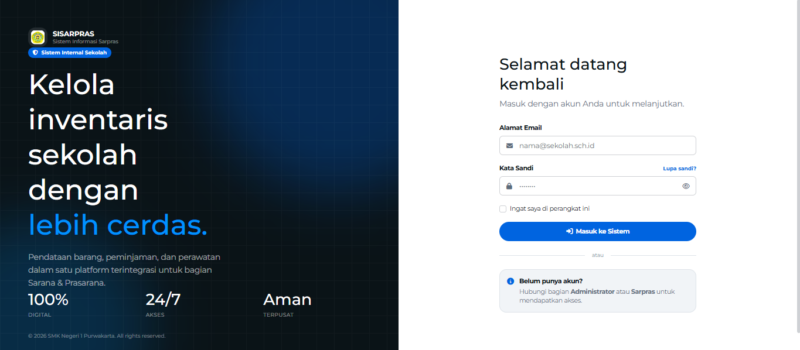

<p align="center">
   <a href="https://github.com/USERNAME/sisarpras" target="_blank">
      
   </a>
</p>

<h1 align="center">
   <a href="https://github.com/USERNAME/sisarpras" target="_blank" align="center">
      SISARPRAS — Sistem Informasi Sarana & Prasarana Sekolah
   </a>
</h1>

<p align="center">
   🚀 Aplikasi manajemen inventaris sekolah yang modern, lengkap, dan mudah digunakan. Dibangun dengan Laravel 12 + PostgreSQL.
</p>

<p align="center">
  <a href="https://github.com/USERNAME/sisarpras/blob/main/LICENSE">
    
  </a>
  <a href="https://github.com/USERNAME/sisarpras/releases/">
    
  </a>
  <a href="https://github.com/USERNAME/sisarpras/issues">
    
  </a>
  <a href="https://github.com/USERNAME/sisarpras/issues">
    
  </a>
  <a href="https://github.com/USERNAME/sisarpras/stargazers">
    
  </a>
  <a href="https://github.com/USERNAME/sisarpras/network/members">
    
  </a>
</p>

<p align="center">
  
  
  
  
  
  
  
  
</p>

<p align="center">
  <kbd>
    
  </kbd>
</p>

---

## 🚀 Introduction

**SISARPRAS** adalah sistem informasi berbasis web untuk mengelola **Sarana & Prasarana Sekolah**. Dirancang untuk membantu operator sekolah, petugas sarpras, dan kepala sekolah dalam mendata aset, mengelola peminjaman, mencatat perawatan, dan menghasilkan laporan inventaris secara profesional.

Dibangun dengan **Laravel 12**, **PostgreSQL 18**, dan **Tailwind CSS 3**, SISARPRAS mengedepankan **kemudahan penggunaan**, **keamanan data**, dan **estetika modern** dengan design system Meta-inspired (pill buttons, cobalt accent, rounded cards).

🔗 **[Live Demo](#)** _(coming soon)_

---

## ⚙️ Installation Guide

Getting started is super simple! Follow the steps below:

1. **Clone the Repository**
   ```bash
   git clone https://github.com/USERNAME/sisarpras.git
   cd sisarpras

2. **Install Composer Dependencies**
   ```bash
   composer install

3. **Copy .env & Generate App Key**
   ```bash
   cp .env.example .env
   php artisan key:generate

4. **Configure Database**
   Open .env file and update your PostgreSQL credentials:
   ```env
   DB_CONNECTION=pgsql
   DB_HOST=127.0.0.1
   DB_PORT=5432
   DB_DATABASE=sisarpras
   DB_USERNAME=postgres
   DB_PASSWORD=your_password
